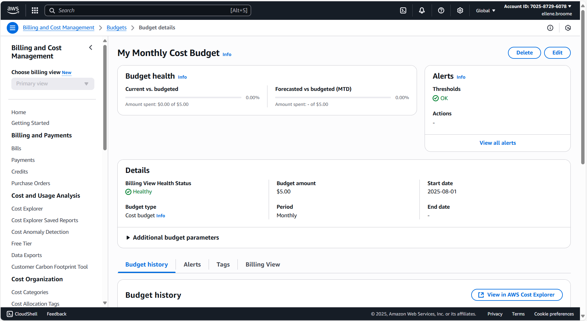

# AWS Setup Assignment

## Part 1: AWS Account & IAM Setup
- Created a new AWS account.
- Set up an IAM user with AdministratorAccess.
- Verified I can log in using the IAM user (NOT the root account).

## Part 2: AWS Budget
- Created a budget with a $5 monthly limit.
- Added an email alert to warn me before I go over budget.

**Screenshot:**

## Part 3: DynamoDB Documentation
**Key Insight:**  
I learned that DynamoDB is a *NoSQL database* that automatically scales to handle millions of requests per second, and you only pay for the amount of storage and requests you use. It automatically sales up and down, so it works well with small apps and really big ones too. This makes it good for apps that grow quickly. NoSQL basically means the it doesn't use rows and colums like Excel.
